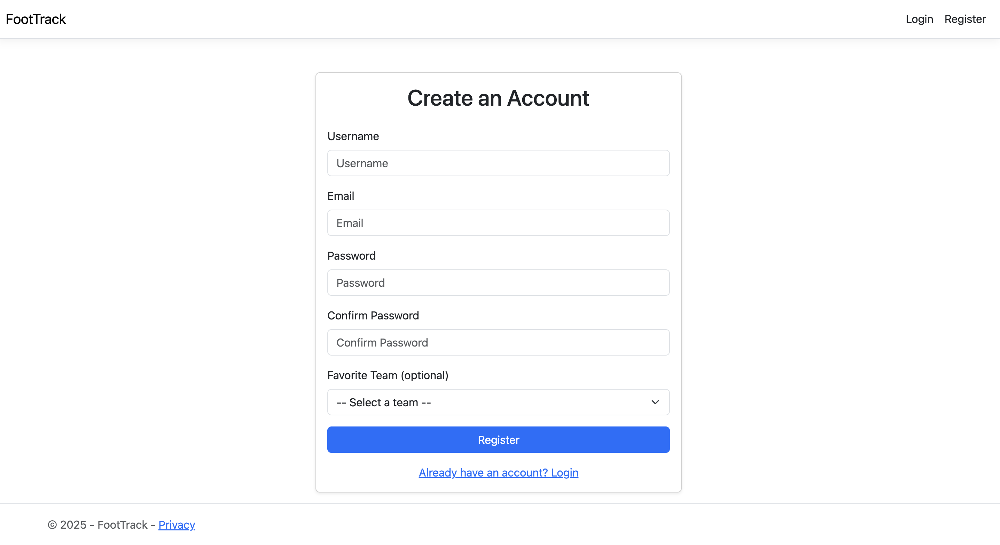
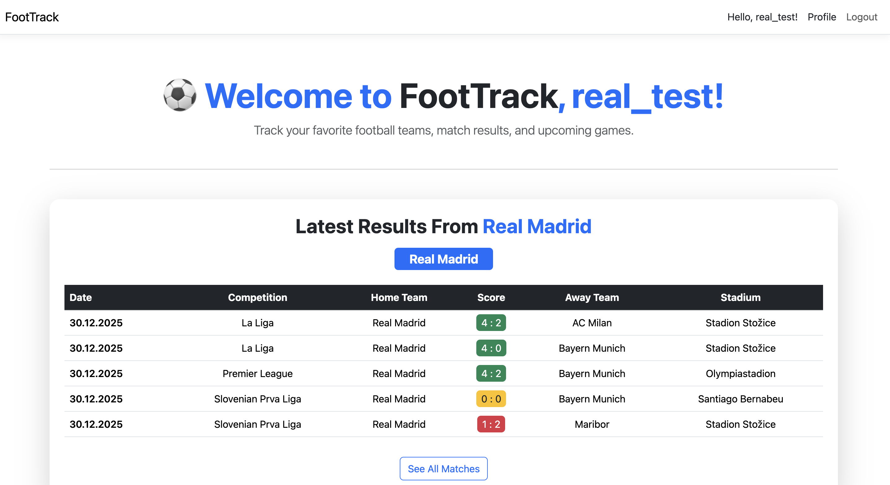
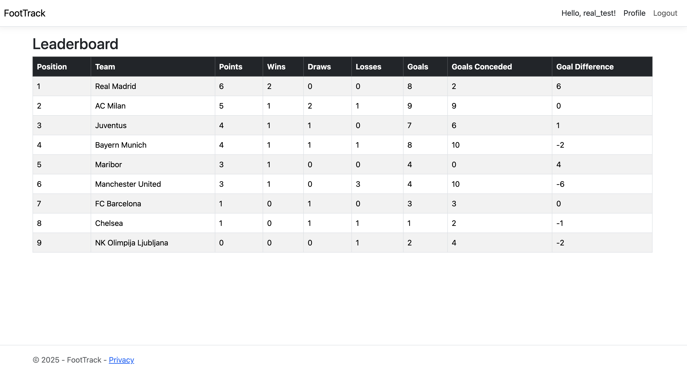
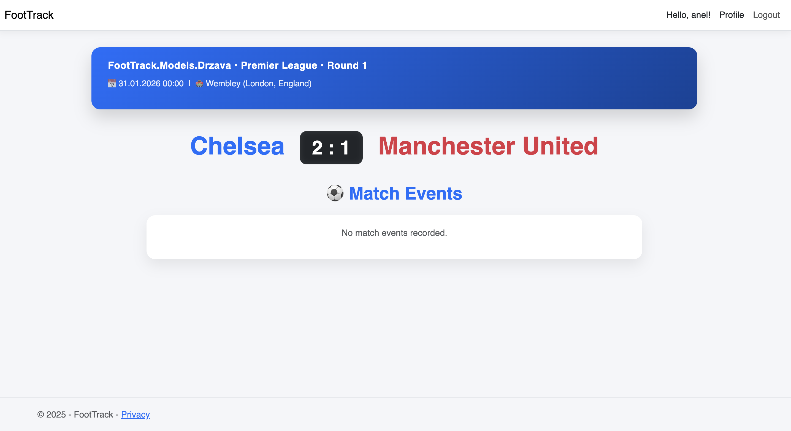

# FootTrack 

**Vpisna številka:** 63240332  
**Avtor:** Anel Torić  

---

## Opis Projekta

Z spletno aplikacijo FootTrack bomo podprli spremljanje rezultatov in statistike nogometnih tekem in tekmovanj.Aplikacija je bila narejena in razvita z uporabo .NET 8.0 in gostovana z MS Azure.

Sistem je sestavljena iz:

- spletne aplikacije,
- REST API spletne storitve,
- podatkovne baze,
- Android odjemalca(Povezan z API)

---

## Link do spletne aplikacije

🔗 https://foottrack-dabec2gyhffmarg3.switzerlandnorth-01.azurewebsites.net/

# Opis Aplikacije

Aplikacija FootTrack omogoča ljubiteljem nogometa veliko različnih funkcij.Sprva se novi uporabnik registra vpiše svoj ime,priimek,uporabniško,email,geslo ter na koncu si izbere svoj najljubšo ekipo.

Po uspešni registraciji navadni uporabniki potem lahko vidijo vse tekme ki jih je odigrala njihova najljubša ekipa,ter lahko vidi kaj se je zgodilo na tekmi,podatki o tekmi(kje se igralo,sodniki,igralci,krog,sezona,tekmovanje...).Navadni uporabniki lahko ogledajo svoj profil lahko ga izbrišejo in vidijo svoje podatke.Navadni uporabniki lahko še vidijo se vsa tekmovanje ki se odvijajo ter vidijo vse kroge v tekmovanju, rezultate itd;ter lahko še vidijo lestvico tekmovanja.Vidijo koliko je vsaka ekipa dosegla golov,prejela golov,število točk,število zmag,remijev,porazev.

Če pa je uporabnik admin lahko on sam ustvari nove tekme ko se zgodijo in vsi uporabniki lahko vidijo nove dodane tekme.

## Tehnologije

- **Backend:** ASP.NET Core 8.0
- **REST API:** JSON
- **Avtentikacija:** ASP.NET Identity
- **Podatkovna baza:** SQL Server (Azure SQL)
- **Hosting:** Microsoft Azure App Service
- **Dokumentacija API:** Swagger UI
- **Mobilni odjemalec:** Android + Volley
- **Orodja:** Git, Docker

# Slike Delovanje Aplikacije

## Lokalni zagon aplikacije

### Potrebna orodja za delovanje

- .NET 8.0
- Git
- Docker

### Postopek

1. Odpreš Bash Terminal
2. git clone https://github.com/aneltoric123/FootTrack.git
3. cd FootTrack
4. dotnet restore (Ustvariš Docker Container če ga nimaš in ga zaženeš)
5. dotnet run

Aplikacijo bo dostopna na https://localhost:5260

